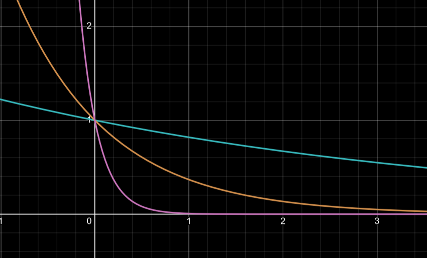
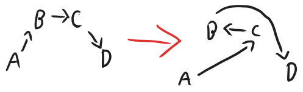

# F1 TSP
F1-tsp is a project to calculate the fastest distance around all of the f1 locations. ~~To do this it currently uses the nearest neighbor algorithm which is admitedly not very optimized, I am looking into implementing better algorithms.~~ There is now simulated annealing implemented as well which I believe has found the fastest way!

## WHY❓
I did this to learn rust and graphviz along with a small bit of trigonometry (have a look at distance.rs). It serves no actual purpose due to the F1 calendar not being based on shortest distances between tracks but if the FIA want to use this optimized calendar, feel free!

## RUN🏃
#### WITH CARGO🚚:
```bash
git clone https://github.com/max-amb/f1-tsp.git && cd f1-tsp
cargo run # To build and run 
```
#### WITHOUT CARGO⛔🚚:
- Go to releases and download the latest binary
- In the same folder as the binary, make a folder named data and place the `f1-locations.json` inside it
- Then make it executable and run it!
```bash
chmod +x {YOUR BINARY}
./{YOUR BINARY}
```
## BUILD👷:
```bash
git clone https://github.com/max-amb/f1-tsp.git && cd f1-tsp
cargo build # To build the binary
```

## Screenshots 📸
* Just nearest neighbour (cost: 63476.25688357275km):

* Just simulated annealing (cost: 52140.55396293411km):

* The comparison:


## Simulated Annealing Explanation (from numerical recipes)
* The idea of reducing cost, the solution/configuration with the lowest cost is the best solution
	* Cost function based upon the distance (for TSP)
* By slowly trying to hone in on the lowest cost we can allow for alternate paths to the lowest cost
	* This is due to the fact that our data is discrete and does not follow a curve (which would suggest as soon as we find a drop in cost we follow it until we reach the end and this would be optimum)
	* The slower the better (rooted in thermodynamics) - the technical definition of annealing
* If you go greedily immediately towards the local minimum you are guaranteed to find a local minimum but not the global
* Natures minimization algorithm follows:

$$
\begin{gather}
	\text{The probability of a singular energy state is given by:} \\
	\text{Prob(E)} \sim \exp{(-E/kT)} \\ \\
	\text{E maps to the cost function (Energy in this case)} \\
	\implies \text{Lower E is better} \\ \\
	\text{T maps to temperature} \\
	\implies \text{The higher the temperature, the more likely the particle is to adopt a higher energy state} \\ 
	\text{This means that at higher temperatures the arrangements are less optimised} \\ \\
	\text{k is a constant (As this is the boltzman distribution it is the boltzman constant)}
\end{gather}
$$

$$
\begin{gather}
\text{The probability of a switch from } E_{1} \text{ to } E_{2} \text{ is given by: }\\
\text{Prob(Jump from } E_{1} \text{ to } E_{2} \text{)} \sim \exp\left( -\frac{E_{2} - E_{1}}{kT} \right) \\ \\
\text{It is obvious here that if } E_{2} < E_{1} \text{ the probability of jumping is >1 hence we set it to 1} \\
\end{gather}
$$


* Blue is where there is a high temperature, orange medium and pink with a low temperature
	* You can see the probability to jump is very reduced at lower temperatures
	* As the area needs to equal 0 the graph stops at $x=0$ and the pink line would start higher up

#### TSP
* TSP is a NP-Complete problem - the compute for an exact solution increases with N nodes $\text{exp(const. } * \text{N)}$
* To use the metropolis algorithm for non-thermodynamic systems, the following elements are required (TSP's examples are here):
	* Cities numbered $i = 0...N-1$ with coordinates $(x_{i}, y_{i})$
	* A configuration is a permutation of the number $0...N-1 \implies N! \text{ permutations}$ 
	* For rearrangements there are two possible efficient moves:
		* Switching the order of two nodes in the path
			* ABCD -> ACBD 
			* 
		* Moving a section of the path to somewhere else in the path
			* ABCDE -> ADEBC
	* Next we need a way to calculate the cost of the configuration
		* A common way is to simply calculate the total length of the path
		* $`E = L = \sum^{N-1}_{i=0} \sqrt{ (x_{i} - x_{i+1})^2 + (y_{i} - y_{i+1})^2}`$
		* This cost function is quite nice because it allows for changes to requirements
			* For example if you wanted to assign a heavy cost to crossing the river (Splitting the map into west and east)
			* $\mu_{i} = 1 \iff \text{node i is on the west}$
			* $\mu_{i} = -1 \iff \text{node i is on the east}$
			* $\lambda = \text{ Cost of crossing}$ 
			* $`E = L = \sum^{N-1}_{i=0} \sqrt{ (x_{i} - x_{i+1})^2 + (y_{i} - y_{i+1})^2} + \lambda(\mu_{i} - \mu_{i+1})`$
			* So here if the next node was across the river an additional cost of $4\lambda$ would be associated with the traversal 
	* Finally we need a good annealing schedule
		* This is how quickly we lower the temperature - how quickly we descend on our local minimums (hoping they are global!!)
		* Initially we randomly generate a path - following that we perform some random rearrangements, collecting some $\Delta E's$ 
		* Then a $T$ is picked that is comfortably above any $\Delta E's$ encountered to provide the really gentle curve we need to hop around to find our minimums
		* Then we keep regenerating the path, if we start getting failed reconfigurations we should look to lower T as we are honing in on a minimum

## ACKNOWLEDGEMENTS🙏
- Thank you to bacinger for the json file provided at his [f1-circuits](https://github.com/bacinger/f1-circuits) repository, I use a modified version within this program!
