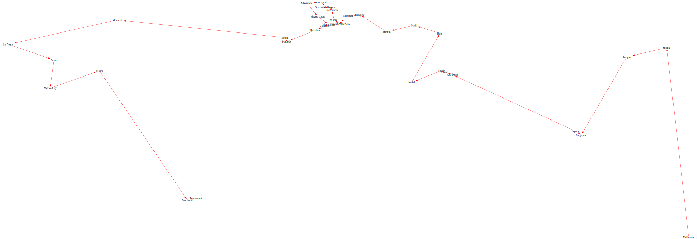

# F1 TSP
F1-tsp is a project to calculate the fastest distance around all of the f1 locations. ~~To do this it currently uses the nearest neighbor algorithm which is admitedly not very optimized, I am looking into implementing better algorithms.~~ There is now simulated annealing implemented as well which I believe has found the fastest way!

## WHY❓
I did this to learn rust and graphviz along with a small bit of trigonometry (have a look at distance.rs). It serves no actual purpose due to the F1 calendar not being based on shortest distances between tracks but if the FIA want to use this optimized calendar, feel free!

## RUN🏃
#### WITH CARGO🚚:
```bash
git clone https://github.com/max-amb/f1-tsp.git && cd f1-tsp
cargo run # To build and run 
```
#### WITHOUT CARGO⛔🚚:
- Go to releases and download the latest binary
- In the same folder as the binary, make a folder named data and place the `f1-locations.json` inside it
- Then make it executable and run it!
```bash
chmod +x {YOUR BINARY}
./{YOUR BINARY}
```
## BUILD👷:
```bash
git clone https://github.com/max-amb/f1-tsp.git && cd f1-tsp
cargo build # To build the binary
```

## Screenshots 📸
* Just nearest neighbour (cost: 63476.25688357275km):

* Just simulated annealing (cost: 52140.55396293411):

* The comparison:


## ACKNOWLEDGEMENTS🙏
- Thank you to bacinger for the json file provided at his [f1-circuits](https://github.com/bacinger/f1-circuits) repository, I use a modified version within this program!
